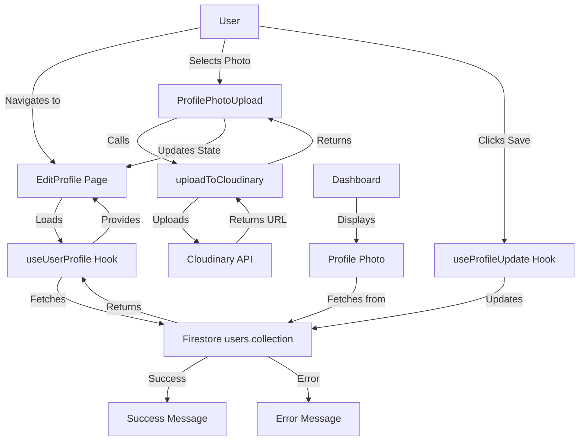

# Design Document: User Profile Edit Feature

## Overview

The user profile edit feature enables authenticated users to update their profile information (name, location, eligible_to_match status) and upload a profile photo. The feature integrates seamlessly with the existing Firebase/Firestore infrastructure and leverages the existing Cloudinary image upload utility.

The design follows a component-based architecture with clear separation between UI components, data services, and state management. The feature consists of:

1. **Type Extensions**: Adding photoUrl field to existing UserProfile types
2. **Profile Edit Page**: A dedicated page component for editing profile information
3. **Photo Upload Component**: A reusable component for uploading and previewing profile photos
4. **Profile Service Hook**: A custom hook for managing profile update operations
5. **Dashboard Enhancement**: Display profile photo on the existing Dashboard

## Architecture

### Component Hierarchy

```
EditProfile (Page)
├── ProfilePhotoUpload (Component)
│   ├── File Input
│   ├── Image Preview
│   └── Upload Button
└── ProfileForm (Component)
    ├── Name Input
    ├── Location Input
    ├── Eligible to Match Toggle
    ├── Save Button
    └── Cancel Button

Dashboard (Enhanced)
└── ProfilePhoto Display
```

### Data Flow



### State Management

The feature uses React hooks for state management:

- **Local Component State**: Form inputs, validation errors, loading states
- **Custom Hooks**: Profile data fetching (useUserProfile), profile updates (useProfileUpdate)
- **Context**: Authentication state (existing AuthContext)

## Components and Interfaces

### 1. Type Extensions

**File**: `src/types/user.ts`

Extend the existing UserProfile and CreateUserProfile interfaces:

```typescript
export interface UserProfile {
  uid: string;
  name: string;
  email: string;
  location: string;
  eligible_to_match: boolean;
  createdAt: Timestamp;
  photoUrl: string | null;  // NEW FIELD
}

export interface CreateUserProfile {
  uid: string;
  name: string;
  email: string;
  location: string;
  eligible_to_match: boolean;
  createdAt: ReturnType<typeof import('firebase/firestore').serverTimestamp>;
  photoUrl: string | null;  // NEW FIELD
}
```

### 2. Profile Update Hook

**File**: `src/hooks/useProfileUpdate.ts`

A custom hook for handling profile update operations:

```typescript
interface ProfileUpdateData {
  name: string;
  location: string;
  eligible_to_match: boolean;
  photoUrl: string | null;
}

interface UseProfileUpdateReturn {
  updateProfile: (data: ProfileUpdateData) => Promise<void>;
  loading: boolean;
  error: string | null;
  success: boolean;
}

function useProfileUpdate(): UseProfileUpdateReturn
```

**Responsibilities**:
- Accept profile update data
- Update Firestore document using authenticated user's uid
- Handle loading, error, and success states
- Provide clear error messages for failures

**Implementation Details**:
- Use `doc()` and `updateDoc()` from firebase/firestore
- Get user uid from AuthContext
- Validate that user is authenticated before updating
- Clear success/error states on new update attempts

### 3. Profile Photo Upload Component

**File**: `src/components/ProfilePhotoUpload.tsx`

A reusable component for uploading profile photos:

```typescript
interface ProfilePhotoUploadProps {
  currentPhotoUrl: string | null;
  onPhotoUploaded: (url: string) => void;
  onError: (error: string) => void;
}

function ProfilePhotoUpload(props: ProfilePhotoUploadProps): JSX.Element
```

**State**:
- `selectedFile: File | null` - Currently selected file
- `previewUrl: string | null` - Preview URL for selected image
- `uploading: boolean` - Upload in progress flag

**Behavior**:
- Display current photo if available, otherwise show placeholder
- Provide file input for selecting images
- Generate preview URL using `URL.createObjectURL()` when file selected
- Validate file type before showing preview
- Call `uploadToCloudinary()` when user confirms upload
- Display upload progress indicator during upload
- Call `onPhotoUploaded` callback with URL on success
- Call `onError` callback with error message on failure
- Clean up preview URLs using `URL.revokeObjectURL()` on unmount

### 4. Edit Profile Page

**File**: `src/pages/EditProfile.tsx`

The main page component for editing profile information:

```typescript
function EditProfile(): JSX.Element
```

**State**:
- `name: string` - User's name
- `location: string` - User's location
- `eligibleToMatch: boolean` - Matching eligibility status
- `photoUrl: string | null` - Profile photo URL
- `validationErrors: Record<string, string>` - Field validation errors
- `hasChanges: boolean` - Track if form has unsaved changes

**Behavior**:
- Load current profile data using `useUserProfile` hook
- Populate form fields with current data
- Track changes to form fields
- Validate name and location are not empty
- Handle photo upload completion
- Call `useProfileUpdate` hook to save changes
- Display success message on successful save
- Display error messages on failures
- Provide cancel button to navigate back to Dashboard
- Disable save button when validation errors exist or no changes made

**Validation Rules**:
- Name: Required, non-empty string
- Location: Required, non-empty string
- Photo: Optional, validated by ProfilePhotoUpload component

### 5. Dashboard Enhancement

**File**: `src/pages/Dashboard.tsx`

Enhance the existing Dashboard to display profile photo:

**Changes**:
- Add profile photo display in the User Information Card
- Show circular profile photo if photoUrl exists
- Show default avatar icon if photoUrl is null
- Add "Edit Profile" button that navigates to `/edit-profile`
- Style photo with appropriate sizing (e.g., 80x80px or 100x100px)

**Photo Display Logic**:
```typescript
{profile?.photoUrl ? (
  
) : (
  <div className="w-20 h-20 rounded-full bg-gray-300 flex items-center justify-center">
    <UserIcon className="w-10 h-10 text-gray-600" />
  </div>
)}
```

## Data Models

### UserProfile (Extended)

```typescript
interface UserProfile {
  uid: string;              // Firebase Auth user ID
  name: string;             // User's display name
  email: string;            // User's email address
  location: string;         // User's location
  eligible_to_match: boolean; // Matching eligibility flag
  createdAt: Timestamp;     // Account creation timestamp
  photoUrl: string | null;  // Cloudinary photo URL or null
}
```

**Firestore Document Path**: `users/{uid}`

**Field Constraints**:
- `uid`: Immutable, set on creation
- `email`: Immutable, set on creation
- `name`: Required, non-empty string
- `location`: Required, non-empty string
- `eligible_to_match`: Boolean, defaults to false
- `createdAt`: Immutable, set on creation
- `photoUrl`: Optional, must be valid Cloudinary URL or null

### ProfileUpdateData

```typescript
interface ProfileUpdateData {
  name: string;
  location: string;
  eligible_to_match: boolean;
  photoUrl: string | null;
}
```

This is the data structure passed to the update operation. It excludes immutable fields (uid, email, createdAt).

## Correctness Properties


A property is a characteristic or behavior that should hold true across all valid executions of a system—essentially, a formal statement about what the system should do. Properties serve as the bridge between human-readable specifications and machine-verifiable correctness guarantees.

### Property 1: Profile data population on load

*For any* valid UserProfile data, when the Profile_Editor loads, all form fields should be populated with the corresponding values from the profile (name field contains profile.name, location field contains profile.location, eligible_to_match toggle reflects profile.eligible_to_match).

**Validates: Requirements 2.2**

### Property 2: Empty name validation

*For any* string composed entirely of whitespace or empty string, when set as the name field value, the system should display a validation error and mark the field as invalid.

**Validates: Requirements 2.3, 7.1**

### Property 3: Empty location validation

*For any* string composed entirely of whitespace or empty string, when set as the location field value, the system should display a validation error and mark the field as invalid.

**Validates: Requirements 2.4, 7.2**

### Property 4: Toggle state update

*For any* initial boolean value of eligible_to_match, toggling the field should immediately update the state to the opposite value.

**Validates: Requirements 2.5**

### Property 5: Valid image type acceptance

*For any* file with MIME type 'image/jpeg', 'image/png', 'image/gif', or 'image/webp', the Photo_Uploader should accept the file and allow upload.

**Validates: Requirements 3.2**

### Property 6: Invalid file type rejection

*For any* file with a MIME type not in the allowed list (JPEG, PNG, GIF, WebP), the Photo_Uploader should reject the file before calling uploadToCloudinary and display a validation error.

**Validates: Requirements 3.3**

### Property 7: Image preview generation

*For any* valid image file selected by the user, the Photo_Uploader should generate and display a preview URL using URL.createObjectURL().

**Validates: Requirements 3.4**

### Property 8: Photo URL storage after upload

*For any* successful photo upload, the photoUrl field in the profile should contain the secure URL returned from the uploadToCloudinary function.

**Validates: Requirements 1.4, 3.6**

### Property 9: Upload error display

*For any* photo upload failure, the system should display the error message returned from the uploadToCloudinary function.

**Validates: Requirements 3.7, 6.5**

### Property 10: Profile photo display with URL

*For any* UserProfile with a non-null photoUrl, the Dashboard should render an img element with src attribute set to that photoUrl.

**Validates: Requirements 4.1**

### Property 11: Correct document targeting

*For any* authenticated user performing a profile update, the Profile_Service should target the Firestore document with ID matching the user's uid.

**Validates: Requirements 5.2**

### Property 12: Update error display

*For any* profile update operation failure, the system should display an error message containing details about the failure.

**Validates: Requirements 5.4**

### Property 13: Profile update round-trip

*For any* valid ProfileUpdateData, after successfully updating the profile and refreshing the data, the retrieved profile should contain the updated values.

**Validates: Requirements 5.5**

### Property 14: Error clearing on retry

*For any* error state (upload error or update error), when the user retries the operation, the previous error message should be cleared before the new operation begins.

**Validates: Requirements 6.6**

### Property 15: Save button state based on validation

*For any* form state, the save button should be disabled if and only if validation errors exist or no changes have been made to the form.

**Validates: Requirements 7.3, 7.4**

### Property 16: Navigation to edit profile

*For any* click event on the edit profile button in the Dashboard, the system should navigate to the /edit-profile route.

**Validates: Requirements 8.2**

### Property 17: Protected route authentication

*For any* unauthenticated access attempt to the /edit-profile route, the system should redirect to the login page.

**Validates: Requirements 8.3**

## Error Handling

### Validation Errors

**Name Validation**:
- Empty string or whitespace-only: "Name is required"
- Display inline with name input field
- Prevent form submission

**Location Validation**:
- Empty string or whitespace-only: "Location is required"
- Display inline with location input field
- Prevent form submission

**Photo Upload Validation**:
- Invalid file type: Use error message from uploadToCloudinary
- Display near photo upload component
- Do not prevent other form fields from being saved

### Network Errors

**Profile Update Failures**:
- Network error: "Unable to save profile. Please check your connection and try again."
- Permission denied: "You don't have permission to update this profile."
- Document not found: "Profile not found. Please try logging in again."
- Unknown error: "Failed to save profile. Please try again."

**Photo Upload Failures**:
- Delegate all error handling to uploadToCloudinary function
- Display returned error message to user
- Allow user to retry upload
- Do not block saving other profile fields if photo upload fails

### State Management

**Error State Clearing**:
- Clear validation errors when user modifies the invalid field
- Clear upload errors when user selects a new file
- Clear update errors when user clicks save again
- Clear all errors when user cancels and returns to Dashboard

**Loading State Management**:
- Show loading indicator during profile data fetch
- Disable save button and show loading state during update
- Show upload progress during photo upload
- Prevent multiple simultaneous operations

## Testing Strategy

### Unit Tests

Unit tests should focus on specific examples, edge cases, and integration points:

**Component Tests**:
- ProfilePhotoUpload renders with no photo (default placeholder)
- ProfilePhotoUpload renders with existing photo URL
- EditProfile renders with loading state
- EditProfile renders with error state
- Dashboard renders edit profile button
- Dashboard renders default avatar when photoUrl is null

**Hook Tests**:
- useProfileUpdate returns error when user is not authenticated
- useProfileUpdate clears previous errors on new update
- useProfileUpdate sets success state after successful update

**Validation Tests**:
- Empty string name triggers validation error
- Whitespace-only location triggers validation error
- Valid name and location pass validation
- Save button disabled when validation errors exist
- Save button disabled when no changes made

**Error Handling Tests**:
- Invalid file type shows error message
- Upload failure displays error from Cloudinary
- Update failure displays appropriate error message
- Retry clears previous error

### Property-Based Tests

Property tests should verify universal properties across all inputs. Each test should run a minimum of 100 iterations.

**Property Test 1: Profile data population**
- Generate random UserProfile data
- Render EditProfile with that data
- Verify all fields populated correctly
- Tag: **Feature: user-profile-edit, Property 1: Profile data population on load**

**Property Test 2: Empty name validation**
- Generate random whitespace strings (spaces, tabs, newlines, empty)
- Set as name field value
- Verify validation error displayed
- Tag: **Feature: user-profile-edit, Property 2: Empty name validation**

**Property Test 3: Empty location validation**
- Generate random whitespace strings
- Set as location field value
- Verify validation error displayed
- Tag: **Feature: user-profile-edit, Property 3: Empty location validation**

**Property Test 4: Toggle state update**
- Generate random initial boolean value
- Toggle the field
- Verify state is opposite of initial value
- Tag: **Feature: user-profile-edit, Property 4: Toggle state update**

**Property Test 5: Valid image type acceptance**
- Generate files with valid MIME types (image/jpeg, image/png, image/gif, image/webp)
- Attempt to select each file
- Verify file is accepted
- Tag: **Feature: user-profile-edit, Property 5: Valid image type acceptance**

**Property Test 6: Invalid file type rejection**
- Generate files with invalid MIME types (text/plain, application/pdf, video/mp4)
- Attempt to select each file
- Verify file is rejected with error
- Tag: **Feature: user-profile-edit, Property 6: Invalid file type rejection**

**Property Test 7: Image preview generation**
- Generate random valid image files
- Select each file
- Verify preview URL is generated and not null
- Tag: **Feature: user-profile-edit, Property 7: Image preview generation**

**Property Test 8: Photo URL storage**
- Mock uploadToCloudinary to return random URLs
- Upload random image files
- Verify photoUrl matches returned URL
- Tag: **Feature: user-profile-edit, Property 8: Photo URL storage after upload**

**Property Test 9: Upload error display**
- Mock uploadToCloudinary to throw random errors
- Attempt upload
- Verify error message is displayed
- Tag: **Feature: user-profile-edit, Property 9: Upload error display**

**Property Test 10: Profile photo display**
- Generate random photoUrl values
- Render Dashboard with profile containing photoUrl
- Verify img element src matches photoUrl
- Tag: **Feature: user-profile-edit, Property 10: Profile photo display with URL**

**Property Test 11: Correct document targeting**
- Generate random user uids
- Mock Firestore update
- Perform profile update
- Verify document ID matches user uid
- Tag: **Feature: user-profile-edit, Property 11: Correct document targeting**

**Property Test 12: Update error display**
- Mock Firestore to throw random errors
- Attempt profile update
- Verify error message is displayed
- Tag: **Feature: user-profile-edit, Property 12: Update error display**

**Property Test 13: Profile update round-trip**
- Generate random ProfileUpdateData
- Update profile
- Fetch profile
- Verify fetched data matches updated data
- Tag: **Feature: user-profile-edit, Property 13: Profile update round-trip**

**Property Test 14: Error clearing on retry**
- Generate random error states
- Trigger retry operation
- Verify error is cleared before new operation
- Tag: **Feature: user-profile-edit, Property 14: Error clearing on retry**

**Property Test 15: Save button state**
- Generate random form states (with/without errors, with/without changes)
- Verify button disabled state matches validation and change state
- Tag: **Feature: user-profile-edit, Property 15: Save button state based on validation**

**Property Test 16: Navigation to edit profile**
- Simulate click on edit button
- Verify navigation to /edit-profile
- Tag: **Feature: user-profile-edit, Property 16: Navigation to edit profile**

**Property Test 17: Protected route authentication**
- Generate unauthenticated state
- Attempt to access /edit-profile
- Verify redirect to login
- Tag: **Feature: user-profile-edit, Property 17: Protected route authentication**

### Testing Tools

- **Unit Testing**: Vitest + React Testing Library
- **Property-Based Testing**: fast-check (JavaScript/TypeScript PBT library)
- **Mocking**: Vitest mocking utilities for Firebase and Cloudinary
- **Test Configuration**: Minimum 100 iterations per property test
